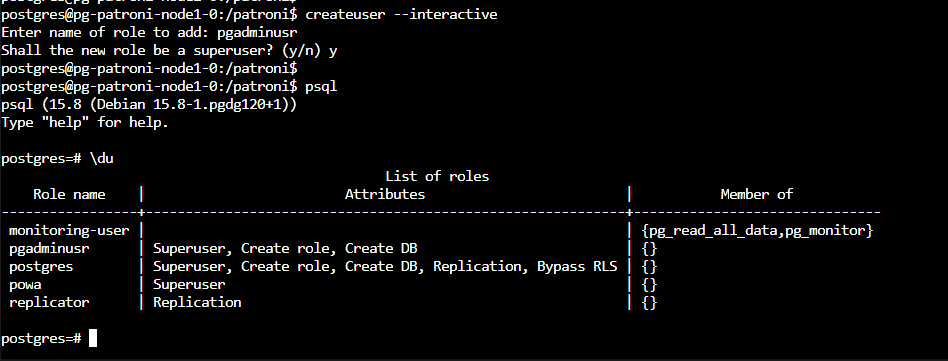
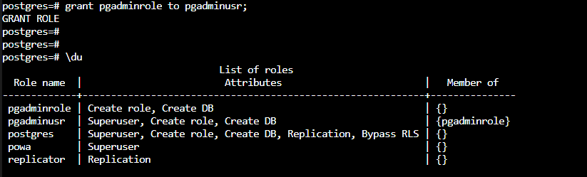
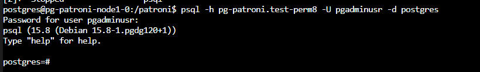

This section covers the ldap integration with PostgreSQL service.

## Postgres LDAP authentication configuration
### Overview
LDAP (Lightweight Directory Access Protocol) is an open standard protocol that provides cross-platform support for accessing and maintaining directory services over a network.

A directory service is a database that stores information about network resources, such as users, groups, and devices.

A directory is a hierarchical structure that contains information about objects or entities, such as users, groups, devices, or services, and their attributes, such as names, addresses, phone numbers, email addresses, or security policies.

LDAP is based on a client-server model, where a client sends a request to a server and the server responds with the requested information.

It is widely used in enterprise environments for authentication, authorization, and user management.

### Simple Basic Diagram


# Input Parameters

The required parameters to integrate LDAP with postgres is described in the [LDAP Configuration section](/docs/public/installation.md#ldap).

# AD/LDAP side configuration
We have created below 2 user’s i.e.

pgbindusr ==> this account will be used to query the Active Directory database.

pgadminusr ==> this account will be used as an example to access the PostgreSQL service.

And a role which will allow users to be matched with ldap config in pg_hba of postgres. The role name is hardcoded as pgadminrole.
This role will be automatically created when ldap is enabled in deployment params. Users just need to grant this role to their ldap user.

PostgreSQL configuration
1) Created same user i.e. pgadminusr in PostgreSQL DB without any password.



2) Grant pgadminrole to above created user.



3) Connect to the PostgreSQL server using the pgbindusr account with the password set on the Active directory.



* Note: LDAP server and other configuration used for above demo were as follow : 

```yaml

ldap:
  enabled: true
  server: testad.server.com
  port: 389
  basedn: "cn=Users,dc=testad,dc=local"
  binddn: "CN=pgbindusr,CN=Users,dc=testad,dc=local"
  bindpasswd: "Pass_123!"
```
* To test LDAP connectivity, credentials, and the retrieval of user attributes from the directory, users can use query like below :

```yaml
ldapsearch -x -H ldap://testad.server.com:389 -D "CN=pgbindusr,CN=Users,dc=testad,dc=local" -w "Pass_123!" -b "dc=testad,dc=local" "(sAMAccountName=pgbindusr)"
```

Above query is using ldapsearch to search for a specific user (pgbindusr) in an LDAP directory. If the query is successful, the result should return the details of the pgbindusr account from the LDAP directory.


